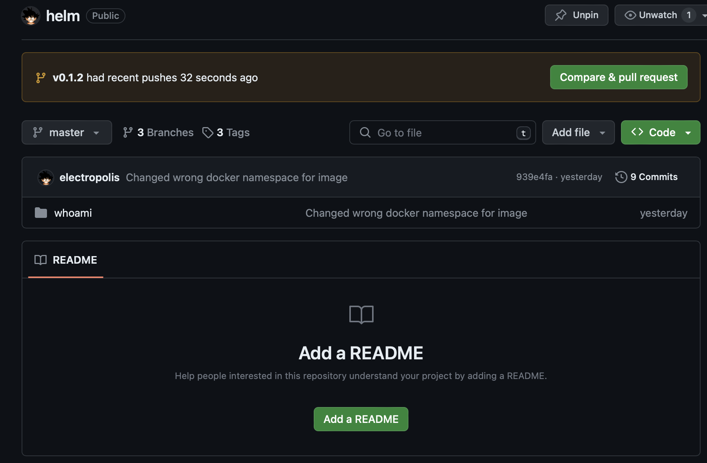

## Introduction

#### CI

This repository contains `whoami` app that was forked. It has additional ci/workflow added in `github/workflow/image.yml` that is responsible for creating Docker image with tag based on semantic versionionig. It also includes changes in `electropolis/helm` repository that modifies `appVersion:` in `Chart.yaml` of `whoami` helm chart with previosly created tag in new branch with the same name as the tag. Its gives the ability to create Pull Request in `electopolis/helm` repo. `appVersion` key is used as a variable in `templates/deplyment.yaml` that was reffered in `.Chart.AppVersion` . This variable defines image Tag do be pushed from dockerhub. 

#### CD

The `electropolis/helm` repo is *watched* by ArgoCD instance on k3s cluster. That waits for every changes in the `master` branch. 

#### Infrastructure

Infrastructure is deployed in GCP on *Virtual Machine* with provisioning tool terraform that creates all required resources
 - Netwoek VPC (without default and default route)
 - VPC Subnet 
 - firewall rules
 - external static IP
 - A preemptible compute engine virtual machine with defined ssh keys

Script isn't much sophisticated as the goal of the whole process was to make as easy as possible, without defining any static variables, defining for loops and so on. The script in in ...repo_url

Virtual Machine are prepared after provisioning wih Ansible configuration management tool. A specific playbook is prepared that uses `k3s` role. 


#### Diagram


## CI Step in practice

#### 1. Repo [electropolis/whoami](https://github.com/electropolis/whoami)

Starting changes by commiting them with new tag 

```zsh
git add .
git commit -m "New release v0.1.2"
git tag -a v0.1.2 HEAD -m "0.1.2"
git push --follow-tags
```
That triggers few pipelines. One of them is `image.yml` that contains two depended jobs: 
 * `build-push`
 * `helm-app-version`


First job will build docker image with new tag based on the `git tag` taken from  that was attached to the commit hash. Second will clone the [`electropolis/helm`](https://github.com/electropolis/helm) repo modify the `Chart.yml` file with new tag in the new branch. This job also ads the new tag to the commit and push changes to the repository in new branch. 



The changes are visible in the Pull Request created from new branch


After merging the changes pushed by `git[bot]` - the new short commit hash will be synced in ArgoCD


## CD Step in practice

#### 2. Repo [electropolis/infrastructure](https://github.com/electropolis/infrastructure)

Infrastructure contains two directories `ansible` and `terraform`

`vm.tf` in `terraform` provision new VM with all required resources that was already explained in the [Introduction](#introduction) section.

Ansible contains `roles/` and `kubernetes` playbook directory. `hosts` file should be filled with external IP of the previously created Virtual Machine by terraform. Example terraform output

```bash
Outputs:

vm_external_ip = "34.170.74.10"
```

The script is set to use `ServiceLB` and `--node-external-ip` parameter that sets `DeamonSet` which listens for services objects with `spec.type.LoadBalancer` to attach external IP in EXTERNAL IP column. 
`k3s` role also fetches the k3s.yaml that contains kubeconfig content and saves it to `~/.kube/config` with the external IP for kubernetes API service to automate process of configuring kubectl access.

#### 3. ArgoCD

ArgoCD is used as deployment tool that helps to implement GitOps approach with pull based deployment. It listens to the configured repo and check every 3 min for any changes in the `master` branch in `electropolis/helm` repository that contains `whoami` chart. 

##### Installing ArgoCD

```bash
kubectl create ns argocd
kubectl apply -n argocd -f https://raw.githubusercontent.com/argoproj/argo-cd/stable/manifests/install.yaml
```
For access to new ArgoCD Instance retrive the generated password for `admin` user from kubernetes secret object

```bash
kubectl -n argocd get secret argocd-initial-admin-secret -o jsonpath="{.data.password}" | base64 -d
```

Because of the Virtual Machine instance with External IP => _vm_external_ip_ newly created ArgoCD Service needs to be patched  with `spec.type.LoadBalancer` 

```bash
kubectl -n argocd patch svc/argocd-server -p '{"spec": {"type": "LoadBalancer"}}'
```

ArgoCD should be then entered using `https://{vm_external_ip}`

##### Setting up ArgoCD

To add `whoami` app in ArgoCD it can be done using GUI or according the IaC approach it can be done using object of kind `Application` that is attached to [`electropolis/helm`](https://github.com/electropolis/helm) repo. File: `argocd-app-config.yaml` That file contains already defined source repo (_electropolis/helm_) including parameters that manipulates kubernetes service to type _LoadBalancer_ excluding the setting from `values.yaml` 

```
kubectl apply -f argocd-app-config.yaml
```

##### Verification

After applying the Application manifest the deployment should start in ArgoCD


```bash
❯ kubectl get deployment -n whoami whoami -o wide
NAME     READY   UP-TO-DATE   AVAILABLE   AGE   CONTAINERS   IMAGES               SELECTOR
whoami   1/1     1            1           19m   whoami       eset/whoami:v0.1.2   app.kubernetes.io/instance=whoami,app.kubernetes.io/name=whoami
❯ kubectl -n whoami get svc/whoami -o wide
NAME     TYPE           CLUSTER-IP   EXTERNAL-IP    PORT(S)          AGE     SELECTOR
whoami   LoadBalancer   10.0.20.22   34.170.74.10   8080:32683/TCP   3m24s   app.kubernetes.io/instance=whoami,app.kubernetes.io/name=whoami
```
